# FoodCart Server

## A Modern Food Ordering Backend System

---

## Abstract

This report presents **FoodCart Server**, a backend application developed for an online food ordering platform. Built using Node.js and Express.js, the system provides a complete solution for managing food menus, user accounts, shopping carts, orders, and payment processing. The application leverages MongoDB Atlas for cloud-based data storage and supports multiple payment gateways including Stripe and SSLCommerz.

---

## 1. Introduction

### 1.1 Background

The food delivery industry has experienced significant growth, creating demand for robust backend systems that can handle user authentication, order management, and secure payment processing. **FoodCart Server** addresses these requirements by providing a RESTful API backend designed for scalability and ease of integration.

### 1.2 Objectives

- Develop a secure user authentication system using JWT
- Implement a complete shopping cart and order management system
- Integrate multiple payment gateways for flexibility
- Deploy on a serverless platform for cost-effective scaling

### 1.3 Project Information

| Attribute        | Details                  |
| ---------------- | ------------------------ |
| **Project Name** | halal-food-corner-server |
| **Version**      | 1.0.0                    |
| **Platform**     | Node.js                  |
| **Database**     | MongoDB Atlas            |
| **Deployment**   | Vercel (Serverless)      |

---

## 2. Technology Stack

### 2.1 Backend Framework

**Express.js (v4.21.2)** was chosen as the web application framework due to its:

- Minimal and flexible design
- Large ecosystem of middleware
- Excellent performance for REST APIs

### 2.2 Database

**MongoDB Atlas (v6.15.0 driver)** provides:

- Cloud-hosted NoSQL database
- Flexible document-based schema
- Built-in scalability and replication

### 2.3 Authentication

**JSON Web Tokens (v9.0.2)** enable:

- Stateless authentication
- Secure token-based sessions
- Role-based access control

### 2.4 Payment Processing

| Gateway                 | Region        | Purpose                 |
| ----------------------- | ------------- | ----------------------- |
| **Stripe** (v17.7.0)    | International | Card payments worldwide |
| **SSLCommerz** (v1.1.0) | Bangladesh    | Local payment methods   |

---

## 3. System Architecture

### 3.1 Architecture Diagram

```mermaid
flowchart TB
    subgraph Clients["Frontend Applications"]
        WEB["🌐 Web Application"]
        MOBILE["📱 Mobile Application"]
    end

    subgraph Backend["FoodCart Server"]
        API["Express.js API"]
        AUTH["JWT Authentication"]
        RBAC["Role-Based Access"]
    end

    subgraph Data["Data Layer"]
        DB[("MongoDB Atlas")]
    end

    subgraph Payment["Payment Services"]
        STRIPE["Stripe API"]
        SSL["SSLCommerz API"]
    end

    WEB --> API
    MOBILE --> API
    API --> AUTH
    AUTH --> RBAC
    API --> DB
    API --> Payment
```



### 3.2 Request Flow

1. Client sends HTTP request to Express.js server
2. CORS middleware validates origin
3. JWT middleware authenticates user (if required)
4. Admin middleware checks role (if required)
5. Route handler processes request
6. Database operation executed
7. Response returned to client

---

## 4. Database Design

### 4.1 Database Schema

The application uses the `halalfoodDB` database with six collections:

| Collection | Purpose             | Key Fields                 |
| ---------- | ------------------- | -------------------------- |
| `users`    | User accounts       | `email`, `name`, `role`    |
| `menu`     | Food items          | Item details               |
| `carts`    | Shopping carts      | `email`, item references   |
| `orders`   | Placed orders       | Order details              |
| `payments` | Transaction records | `email`, `cartIds`, amount |
| `reviews`  | Customer feedback   | Review content             |

### 4.2 Entity Relationships


---

## 5. API Design

### 5.1 Authentication Endpoints

| Method | Endpoint | Description           |
| ------ | -------- | --------------------- |
| POST   | `/jwt`   | Generate access token |

### 5.2 User Management Endpoints

| Method | Endpoint              | Description            |
| ------ | --------------------- | ---------------------- |
| GET    | `/users`              | List all users (Admin) |
| POST   | `/users`              | Register new user      |
| GET    | `/users/admin/:email` | Check admin status     |
| PATCH  | `/users/admin/:id`    | Promote to admin       |
| DELETE | `/users/:id`          | Remove user            |

### 5.3 Menu & Reviews Endpoints

| Method | Endpoint   | Description             |
| ------ | ---------- | ----------------------- |
| GET    | `/menu`    | Retrieve all menu items |
| GET    | `/reviews` | Retrieve all reviews    |

### 5.4 Cart Endpoints

| Method | Endpoint     | Description      |
| ------ | ------------ | ---------------- |
| GET    | `/carts`     | Get user's cart  |
| POST   | `/carts`     | Add item to cart |
| DELETE | `/carts/:id` | Remove cart item |

### 5.5 Order & Payment Endpoints

| Method | Endpoint                 | Description               |
| ------ | ------------------------ | ------------------------- |
| POST   | `/orders`                | Create order              |
| POST   | `/create-payment-intent` | Initialize Stripe payment |
| GET    | `/payments/:email`       | Get payment history       |
| POST   | `/payments`              | Record payment            |

---

## 6. Security Implementation

### 6.1 JWT Authentication

The system uses bearer token authentication with a 1-hour expiry:

```javascript
const verifyJWT = (req, res, next) => {
  const authorization = req.headers.authorization;
  const token = authorization.split(" ")[1];
  jwt.verify(token, process.env.ACCESS_TOKEN_SECRET, (err, decoded) => {
    req.decoded = decoded;
    next();
  });
};
```

### 6.2 Role-Based Access Control

Administrative functions are protected by role verification:

```javascript
const verifyAdmin = async (req, res, next) => {
  const user = await usersCollection.findOne({ email: req.decoded.email });
  if (user?.role !== "admin") {
    return res.status(403).send({ error: true, message: "forbidden" });
  }
  next();
};
```

---

## 7. Deployment

### 7.1 Environment Configuration

| Variable              | Purpose           |
| --------------------- | ----------------- |
| `PORT`                | Server port       |
| `DB_USER`             | Database username |
| `DB_PASSWORD`         | Database password |
| `ACCESS_TOKEN_SECRET` | JWT signing key   |
| `STRIPE_SECRET_KEY`   | Payment API key   |

### 7.2 Vercel Serverless Deployment

The application is deployed on Vercel's serverless platform, providing:

- Automatic scaling based on demand
- Zero server maintenance
- Global CDN distribution
- Continuous deployment from Git

---

## 8. Key Features Summary

| Feature             | Implementation                   |
| ------------------- | -------------------------------- |
| User Authentication | JWT with bearer tokens           |
| Role Management     | Admin/User roles with middleware |
| Menu Display        | Public access to food catalog    |
| Shopping Cart       | User-specific cart management    |
| Order Processing    | Complete order lifecycle         |
| Payment Integration | Stripe + SSLCommerz gateways     |
| Review System       | Customer feedback collection     |
| Cloud Database      | MongoDB Atlas integration        |
| Serverless Hosting  | Vercel deployment                |

---

## 9. Project Statistics

| Metric               | Value |
| -------------------- | ----- |
| Total Code Lines     | 274   |
| API Endpoints        | 15    |
| Database Collections | 6     |
| Dependencies         | 7     |
| Payment Gateways     | 2     |

---

## 10. Conclusion

**FoodCart Server** successfully implements a complete backend solution for a food ordering platform. The application demonstrates:

- **Modern Architecture**: RESTful API design with Express.js
- **Secure Authentication**: JWT-based user verification
- **Flexible Payments**: Multi-gateway payment support
- **Scalable Infrastructure**: Cloud database and serverless deployment

The system provides a solid foundation for building food delivery applications that can serve both web and mobile clients.

---

## References

1. Express.js Documentation - https://expressjs.com/
2. MongoDB Atlas Documentation - https://www.mongodb.com/docs/atlas/
3. JSON Web Tokens - https://jwt.io/
4. Stripe API Documentation - https://stripe.com/docs/api
5. SSLCommerz Integration Guide - https://developer.sslcommerz.com/

---

**Prepared by:** Muttakin Islam Hasib  
**Student ID:** 2241091003
**Course:** Web Programming
**Submission Date:** 12 January 2026
